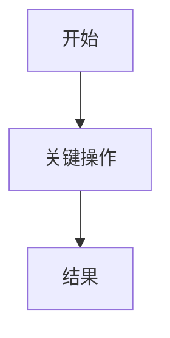
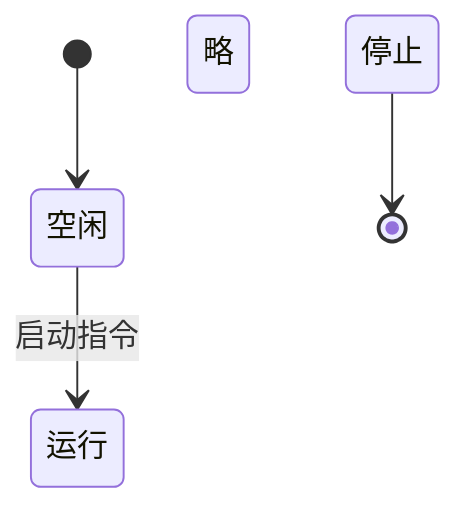

# [待确认：产品名]需求文档（PRD）

## 概述

### PRD信息
| 字段 | 内容 |
| --- | --- |
| 版本 | v0.1 |
| 作者 | [待确认] |
| 日期 | YYYY-MM-DD |

### 修改记录

| 日期   | 版本  | 变更  | 修改人 |
| --- | --- | --- | --- |
|  YYYY-MM-DD | v0.1  | 初稿创建 |  [待确认]  |

## 项目背景

### 背景
- [待确认]

## 用户与场景

### 角色定义
| 用户类型 | 特征 | 核心诉求 | 决策权/影响 |
| --- | --- | --- | --- |
| [待确认] | [待确认] | [待确认] | [待确认] |

设计计策：MVP 阶段设计角色, [待确认]

### 核心场景
| 触发条件 | 当前做法 | 痛点 | 成功标准 |
| --- | --- | --- | --- | --- |
| [待确认] | [待确认] | [待确认] | [待确认] | [待确认] |

## 目标与指标

### 北极星目标

### MVP范围

#### ✅ 做
- **XX功能**：[待确认]

#### ⏸ 暂缓
- [待确认]

#### ❌ 不做
- [待确认]

### 成功指标
| 场景 | 触发条件 | 当前做法 | 痛点 | 成功标准 |
| --- | --- | --- | --- | --- |
| [待确认] | [待确认] | [待确认] | [待确认] | [待确认] |

### 约束条件
| 约束 | 说明 |
| --- | --- |
| [待确认] | [待确认] |

## 产品方案概述

### 主流程
[可包含多个流程]

**主流程说明**：
- [待确认]

### 状态机

**状态机说明**：
- [待确认]

## 核心功能模块详述
[可含多个模块]
### M1 xx功能模块
[每个功能模块包含：目标、用户故事、流程、页面与交互、业务规则、验收标准]
#### 目标
[待确认]

#### 用户故事
| 角色 | 场景 | 需求 | 价值 |
| --- | --- | --- | --- |
|  [待确认] | [待确认] | [待确认] | [待确认] |

#### 流程
[可包含多个流程，根据需要确定]

说明：[待确认]

#### 页面与交互
[页面与交互包含：页面、状态说明]

##### 页面
| 角色 | 场景 | 需求 | 价值 |
| --- | --- | --- | --- |
|  [待确认] | [待确认] | [待确认] | [待确认] |

##### 状态说明
| 状态 | 含义 | 可见操作 |
| --- | --- | --- |
|  [待确认] | [待确认] | [待确认] |

#### 业务规则
[R01对应M1]
| 编号 | 规则 | 触发条件 | 例外 | 待确认 |
| --- | --- | --- | --- | --- |
|  R01-1 | [待确认] | [待确认] | [待确认] | [待确认] |

#### 验收标准
| Given | When | Then |
| --- | --- | --- |
| [待确认] | [待确认] | [待确认] |
| [待确认] | [待确认] | [待确认] |

## 异常处理与业务规则汇总

### 全局异常处理
| 异常类型 | 触发条件 | 处理方式 | 用户提示 | 日志记录 |
| --- | --- | --- | --- | --- |
| [待确认] | [待确认] | [待确认] | [待确认] | [待确认] |

## 数据、埋点与权限

### 数据存储
| 数据类型 | 存储位置 | 说明 |
| --- | --- | --- |
| [待确认] | [待确认] | [待确认] |

### 埋点设计
| 事件 | 触发条件 | 上报参数 | 用途 |
| --- | --- | --- | --- |
| [待确认] | [待确认] | [待确认] | [待确认] |

### 权限模型
| 权限 | 说明 | MVP 状态 |
| --- | --- | --- |
