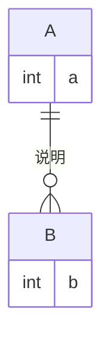
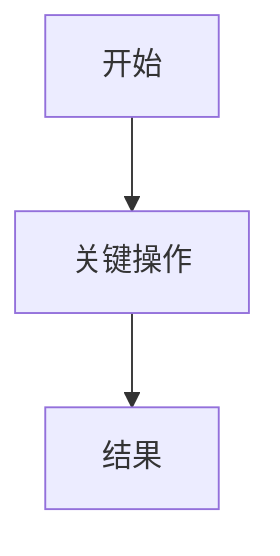
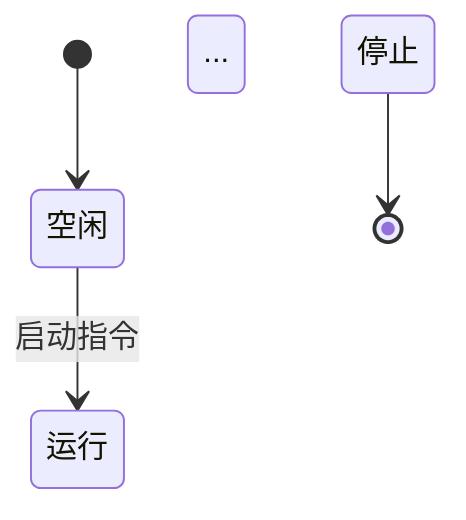
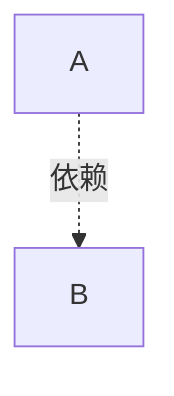

# [待确认：产品名]需求文档（PRD）

## 概述

### PRD信息
| 字段 | 内容 |
| --- | --- |
| 版本 | v0.1 |
| 作者 | [待确认] |
| 日期 |  YYYY-MM-DD |

### 修改记录

| 日期   | 版本  | 变更  | 修改人 |
| --- | --- | --- | --- |
| YYYY-MM-DD | v0.1  | 初稿创建 |  [待确认]  |


## 项目背景

### 背景
- [待确认]

### 产品定位
- [待确认]

### 技术栈
| 层 | 选型 | 说明 |
| --- | --- | --- |
| [待确认] | [待确认] | [待确认] |


## 用户与场景

### 角色定义
| 用户类型 | 特征 | 核心诉求 | 决策权/影响 |
| --- | --- | --- | --- |
| [待确认] | [待确认] | [待确认] | [待确认] |

设计计策：MVP 阶段设计角色, [待确认]

### 核心场景
| 触发条件 | 当前做法 | 痛点 | 成功标准 |
| --- | --- | --- | --- | --- |
| [待确认] | [待确认] | [待确认] | [待确认] | [待确认] |


### JTBD 分析

#### Job Story
[待确认]

#### 功能性任务
| # | 任务 | 情境 | 现有替代方案 | 替代方案的不足 |
| --- | --- | --- | --- | --- |
| F1 | [待确认] | [待确认] | [待确认] | [待确认] |
| F2  | [待确认] | [待确认] | [待确认] | [待确认] |


#### 情感性任务
| # | 任务 | 期望感受 |
| --- | --- | --- |
| E1 | [待确认] | [待确认] |
| E2 | [待确认] | [待确认] |

#### 社会性任务
| # | 任务 | 目标对象 | 期望形象 |
| --- | --- | --- |--- |
| S1 | [待确认] | [待确认] | [待确认] |
| S2 | [待确认] | [待确认] | [待确认] |


#### 四力分析
| Push（当前痛点） | Pull（新方案吸引力） | Anxiety（顾虑） | Habit（惯性） |
| --- | --- | --- | --- |
| [待确认] | [待确认] | [待确认] | [待确认] |


## 目标与指标

### 北极星目标

### MVP范围

#### ✅ 做
- **XX功能**：[待确认]

#### ⏸ 暂缓
- [待确认]

#### ❌ 不做
- [待确认]

### 成功指标
| 场景 | 触发条件 | 当前做法 | 痛点 | 成功标准 |
| --- | --- | --- | --- | --- |
| [待确认] | [待确认] | [待确认] | [待确认] | [待确认] |

### 约束条件
| 约束 | 说明 |
| --- | --- |
| [待确认] | [待确认] |

## 产品方案概述

### 信息架构
- 页面层级树
```
flowchart TD
    A[首页] --> B[页面1]
    A --> C[页面2]
    B --> B1[页面1-1]
    B --> B2[页面1-2]
```

- 说明：
[待确认]

### 核心数据模型
- ER图


- 说明：
[待确认]

### 数据模型详细定义
[数据模型可以包含多张表，可扩展，根据核心数据模型划分表结构]

### 表 A
| 字段 | 类型 | 说明 | 约束 |
| --- | --- | --- | --- |
|[待确认] | [待确认] | [待确认] | [待确认] | 


### 主流程
[可包含多个流程]

**主流程说明**：
- [待确认]

### 状态机

**状态机说明**：
- [待确认]

## 功能需求总览

### 功能模块划分
| 编号 | 模块名称 | 模块功能 | 优先级 | 依赖 |
| --- | --- | --- | --- |---|
| M1 | [待确认] | [待确认] | [待确认] | [待确认] |
| M2 | [待确认] | [待确认] | [待确认] | [待确认] |


### 功能清单
[根据功能模块划分，进一步拆分成子功能]
#### M1
| 编号 | 功能 | 描述 | 优先级 |依赖 |
| --- | --- | --- | --- | --- |
| M1-1 |  [待确认] | [待确认] | [待确认] |[待确认] |

#### M2
| 编号 | 功能 | 描述 | 优先级 |依赖 |
| --- | --- | --- | --- | --- |
| M2-1 |  [待确认] | [待确认] | [待确认] | [待确认] |

### 模块依赖关系

**依赖说明**：
- [待确认]

### 实现顺序建议
| 阶段 | 模块 | 说明 |
| --- | --- | --- |
| 第一阶段 | M1-1 → M1-2 → M2-1 |[待确认] |

## 核心功能模块详述
[可含多个模块，根据功能模块划分确定]

### M1 xx功能模块
[每个功能模块包含：目标、用户故事、流程、页面与交互、业务规则、验收标准]
#### 目标
[待确认]

#### 用户故事
| 角色 | 场景 | 需求 | 价值 |
| --- | --- | --- | --- |
|  [待确认] | [待确认] | [待确认] | [待确认] |

#### 流程
[可包含多个流程，根据需要确定]

说明：[待确认]

#### 页面与交互
[页面与交互包含：页面、状态说明]
##### 页面
| 角色 | 场景 | 需求 | 价值 |
| --- | --- | --- | --- |
|  [待确认] | [待确认] | [待确认] | [待确认] |

##### 状态说明
| 状态 | 含义 | 可见操作 |
| --- | --- | --- |
|  [待确认] | [待确认] | [待确认] |

#### 业务规则
[R01对应M1]
| 编号 | 规则 | 触发条件 | 例外 | 待确认 |
| --- | --- | --- | --- | --- |
|  R01-1 | [待确认] | [待确认] | [待确认] | [待确认] |

#### 验收标准
| Given | When | Then |
| --- | --- | --- |
| [待确认] | [待确认] | [待确认] |
| [待确认] | [待确认] | [待确认] |

## 异常处理与业务规则汇总

### 全局异常处理
| 异常类型 | 触发条件 | 处理方式 | 用户提示 | 日志记录 |
| --- | --- | --- | --- | --- |
| [待确认] | [待确认] | [待确认] | [待确认] | [待确认] |

### 状态流转汇总
| 实体 | 状态 | 允许的流转 | 触发规则 |
| --- | --- | --- | --- |
| [待确认] | [待确认] | [待确认] | [待确认] |

### 业务规则汇总
| 编号 | 规则 | 来源模块 |
| --- | --- | --- |
| R01-1 | [待确认] | M1 |

## 数据、埋点与权限

### 数据存储
| 数据类型 | 存储位置 | 说明 |
| --- | --- | --- |
| [待确认] | [待确认] | [待确认] |

### 埋点设计
| 事件 | 触发条件 | 上报参数 | 用途 |
| --- | --- | --- | --- |
| [待确认] | [待确认] | [待确认] | [待确认] |

### 权限模型
| 权限 | 说明 | MVP 状态 |
| --- | --- | --- |


## 风险与待决事项

### 风险识别
| 风险 | 影响 | 可能性 | 缓解措施 |
| --- | --- | --- | --- |
| [待确认] | [待确认] | 中 | 重|


### 待决事项
| 编号 | 事项 | 影响范围 | 建议 | 状态 |
| --- | --- | --- | --- | --- |
| Q1 | [待确认] | [待确认] | ✅ 已决 |


### 自检清单
- [x] [待确认]
- [x] [待确认]
- [x] [待确认]
